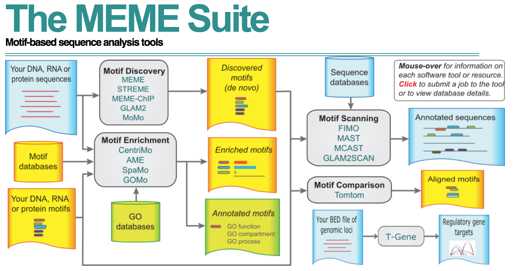

## 1. Finding motifs in a TF ChIP-seq peak set

### MEME suite

MEME is a suite of tools designed to identify, map and compare short motifs enriched in DNA sequences.  
It is particularly well-fitted for analysis of transcription factor binding sites. Many TFs have protein 
domains that specifically recognize a particular DNA sequence, based on their folding.  

Have a look at MEME homepage: 

[](http://meme-suite.org/)

> Which tool do you think will be useful for us? 

### Running MEME to find *de novo* motifs in Reb1 peaks

Let's run MEME on peaks mapped in Reb1 ChIP-seq assay. 

<details><summary style="color: #ff7f00; font-weight: bold">Show code</summary><p>
```{sh, eval = FALSE}
genome='results/genome/genome.fa'
peaks_folder='results/bwa/mergedLibrary/macs/narrowPeak/'
TF='Reb1_R1'
fasta_path="${TF}.fa"
output_dir="meme_out/${TF}"
mode='zoops'
nmotifs=2
min_width=6
max_width=15
#
bedtools getfasta -fi ${genome} -bed ${peaks_folder}/${TF}_peaks.narrowPeak > ${fasta_path}
mkdir meme_out/
meme \
    ${fasta_path} \
    -oc ${output_dir} \
    -searchsize 0 \
    -mod ${mode} \
    -nmotifs ${nmotifs} \
    -minw ${min_width} \
    -maxw ${max_width} \
    -V 
```
</p></details><br>

> What is the purpose of each argument here?   

> Have a look at the output. How are the motifs identified? Where are they located in the MACS2 peaks?  

> Can we avoid getting complementary motifs? 

<details><summary style="color: #ff7f00; font-weight: bold">Show code</summary><p>
Check meme options with meme --help

```{sh, eval = FALSE}
output_dir="meme_out/${TF}_revcomp"
meme \
    ${fasta_path} \
    -oc ${output_dir} \
    -searchsize 0 \
    -mod ${mode} \
    -nmotifs ${nmotifs} \
    -minw ${min_width} \
    -maxw ${max_width} \
    -revcomp \
    -dna \
    -V 
```
</p></details><br>

> What happened to the original two motifs?  

> Do you find other interesting motifs? What can you conclude about Reb1 binding to the DNA?  

> What is the proportion of peaks which contain the putative Reb1 binding motif? 
Was Reb1 supposed to be a particularly successful ChIP-seq experiment, according to MultiQC reports? 
What can you conclude about the meaning of a "bad quality" ChIP-seq library? 

### Running STREME to find *de novo* motifs in Reb1 peaks

STREME is the "newer" MEME. It is faster, more sensitive and its documentation is clearer/simpler. 
It alleviates the need to specify a cumbersome list of obscure parameters.  
Let's have a go at it. 

<details><summary style="color: #ff7f00; font-weight: bold">Show code</summary><p>
```{sh, eval = FALSE}
genome='results/genome/genome.fa'
peaks_folder='results/bwa/mergedLibrary/macs/narrowPeak/'
TF='Reb1_R1'
fasta_path="${TF}.fa"
nmotifs=5
min_width=6
max_width=20
#
bedtools getfasta -fi ${genome} -bed ${peaks_folder}/${TF}_peaks.narrowPeak > ${fasta_path}
mkdir streme_out/
output_dir="streme_out/${TF}"
streme \
    --p ${fasta_path} \
    --oc ${output_dir} \
    --nmotifs ${nmotifs} \
    --minw ${min_width} \
    --maxw ${max_width} 
```
</p></details><br>

> Compare STREME and MEME outputs for Reb1_R1. What do you think?  

> Timewhise, how long did each command take to execute? How many peaks were analyzed in this example? And how many peaks other TF ChIP-seq libraries have in average? Comment. 

### Running STREME to find *de novo* motifs for all TFs

*De novo* motif analyses were conducted with `Streme` for all the ChIP-seq libraries sequenced, using the following gist: 

<details><summary style="color: #ff7f00; font-weight: bold">Show code</summary><p>
```{sh, eval = FALSE}
genome='results/genome/genome.fa'
peaks_folder='results/bwa/mergedLibrary/macs/narrowPeak/'
nmotifs=5
min_width=6
max_width=20
TFs=$(ls ${peaks_folder}*.narrowPeak | sed 's,_peaks.narrowPeak,,' | sed 's,.*/,,g')
#
for TF in ${TFs}
do
    echo -e "\033[0;31m[`date +"%T"`]\033[0;37m Processing ${TF} TF..." 
    fasta_path="${peaks_folder}/${TF}_peaks.narrowPeak.fa"
    peaks="${peaks_folder}/${TF}_peaks.narrowPeak"
    output_dir="streme_out/${TF}"
    bedtools getfasta -fi ${genome} -bed ${peaks} > ${fasta_path}
    streme \
        --p ${fasta_path} \
        --oc ${output_dir} \
        --nmotifs ${nmotifs} \
        --minw ${min_width} \
        --maxw ${max_width} \
        --verbosity 1
done
```
</p></details><br>

> Check out the gist hereabove. Do you understand all the parameters? Is there a reason for increasing nmotifs? What about min_width/max_width?  

> What can you say about the robustness of *de novo* motif analyses? Are they sensitive to ChIP-seq biological replicates? How would you deal with replicates in such case?  

> Have a look at the motifs found enriched in peaks for each TF. Can you find motifs shared amongst multiple TFs?  

## 2. Mapping site location relative to TSSs in the genome

### Importing MACS2 peaks in R

To deal with peak annotations, we can import them in R using the `rtracklayer` package. 
`rtracklayer` is one of the corner stones of the `R/Bioconductor` ecosystem. It allows to 
seamlessly import/export binarized or human-readable data, in or out of R, in most of 
the common genomic file formats. 

<details><summary style="color: #ff7f00; font-weight: bold">Show code</summary><p>
```{r}
Reb1_peaks <- rtracklayer::import('results/bwa/mergedLibrary/macs/narrowPeak/Reb1_R1_peaks.narrowPeak')
```
</p></details><br>

> How many peaks were found in the Reb1 ChIP-seq library? 

<details><summary style="color: #ff7f00; font-weight: bold">Show code</summary><p>
```{r}
length(Reb1_peaks)
```
</p></details><br>

> Where are Reb1 peaks located in the genome? How about Cse4 peaks? And relative to gene annotations?

<details><summary style="color: #ff7f00; font-weight: bold">Show code</summary><p>
```{r}
ChIPseeker::covplot(Reb1_peaks, weightCol = "qValue")
ChIPpeakAnno::genomicElementDistribution(
    Reb1_peaks, 
    TxDb = TxDb.Scerevisiae.UCSC.sacCer3.sgdGene::TxDb.Scerevisiae.UCSC.sacCer3.sgdGene,
    promoterRegion = c(upstream = 2000, downstream = 500),
    geneDownstream = c(upstream = 0, downstream = 2000)
)
#
Cse4_peaks <- rtracklayer::import('results/bwa/mergedLibrary/macs/narrowPeak/Cse4_R1_peaks.narrowPeak')
ChIPseeker::covplot(Cse4_peaks, weightCol = "qValue")
ChIPpeakAnno::genomicElementDistribution(
    Cse4_peaks, 
    TxDb = TxDb.Scerevisiae.UCSC.sacCer3.sgdGene::TxDb.Scerevisiae.UCSC.sacCer3.sgdGene,
    promoterRegion = c(upstream = 2000, downstream = 500),
    geneDownstream = c(upstream = 0, downstream = 2000)
)
```
</p></details><br>

> What is the distribution of peak widths?  

<details><summary style="color: #ff7f00; font-weight: bold">Show code</summary><p>
```{r}
hist(GenomicRanges::width(Reb1_peaks))
```
</p></details><br>

> Where is the peak summit located within each peak?  

<details><summary style="color: #ff7f00; font-weight: bold">Show code</summary><p>
```{r}
Reb1_peak_summits <- rtracklayer::import('results/bwa/mergedLibrary/macs/narrowPeak/Reb1_R1_summits.bed')
pos <- {GenomicRanges::end(Reb1_peak_summits) - GenomicRanges::start(Reb1_peaks)} / {GenomicRanges::end(Reb1_peaks) - GenomicRanges::start(Reb1_peaks)}
hist(pos)
```
</p></details><br>

### Importing MEME motifs in R

Another task would be to import Probability Weight Matrices (PWMs) 
computed by by MEME.  
To do so, we can leverage several packages: 

* `universalmotif` is used to import STREME (or MEME) `.txt` output as PWMs. 
* `BSgenome` and `Biostrings` packages are used to recover the entire Yeast genomic sequence
* `TFBSTools` is used to map a PWM of interest on a entire genome sequence. 

> Let's import Reb1 and Abf1 motif PWMs and map their binding sites found in the genome. 

<details><summary style="color: #ff7f00; font-weight: bold">Show code</summary><p>
```{r}
`%over%` <- IRanges::`%over%`
genome <- BSgenome.Scerevisiae.UCSC.sacCer3::BSgenome.Scerevisiae.UCSC.sacCer3
class(genome)
genome
yeast_sequences <- Biostrings::getSeq(genome, names(genome))
yeast_sequences
#
Reb1_motifs <- universalmotif::read_meme('results/streme_out/Reb1_R1/streme.txt')
Reb1_PWM <- TFBSTools::PWMatrix(ID = 'Reb1', profileMatrix = Reb1_motifs[[1]]@motif)
Reb1_hits <- c(
    as(
        TFBSTools::searchSeq(
            Reb1_PWM, 
            yeast_sequences, 
            strand = '+', 
            min.score = '60%'
        ),
        'GRanges'
    ),
    as(
        TFBSTools::searchSeq(
            Reb1_PWM, 
            yeast_sequences, 
            strand = '-', 
            min.score = '60%'
        ),
        'GRanges'
    )
)
Reb1_hits <- Reb1_hits[order(Reb1_hits$relScore, decreasing = TRUE)]
Reb1_hits
Reb1_hits <- Reb1_hits[Reb1_hits$relScore >= 0.80]
Reb1_hits
#
Abf1_motifs <- universalmotif::read_meme('results/streme_out/Abf1_R1/streme.txt')
Abf1_PWM <- TFBSTools::PWMatrix(ID = 'Abf1', profileMatrix = Abf1_motifs[[1]]@motif)
Abf1_hits <- c(
    as(
        TFBSTools::searchSeq(
            Abf1_PWM, 
            yeast_sequences, 
            strand = '+', 
            min.score = '60%'
        ),
        'GRanges'
    ),
    as(
        TFBSTools::searchSeq(
            Abf1_PWM, 
            yeast_sequences, 
            strand = '-', 
            min.score = '60%'
        ),
        'GRanges'
    )
)
Abf1_hits <- Abf1_hits[order(Abf1_hits$relScore, decreasing = TRUE)]
Abf1_hits
Abf1_hits <- Abf1_hits[Abf1_hits$relScore >= 0.80]
Abf1_hits
```
</p></details><br>

> Compare the peaks found by MACS2 witht the binding motifs found 
when mapping the STREME-derived PWMs onto the Yeast genome sequence. 
Are they overlapping? How far from the nearest motif each peak is?  

<details><summary style="color: #ff7f00; font-weight: bold">Show code</summary><p>
```{r}
table(Reb1_hits %over% Reb1_peaks)
```
</p></details><br>

> Check the seqnames of the 2 GRanges objects. Are they strictly identical? 

<details><summary style="color: #ff7f00; font-weight: bold">Show code</summary><p>
```{r}
GenomeInfoDb::seqlevelsStyle(Reb1_hits)
GenomeInfoDb::seqlevelsStyle(Reb1_peaks)
GenomeInfoDb::seqlevelsStyle(Reb1_hits) <- "NCBI"
table(Reb1_peaks %over% Reb1_hits)
dist <- GenomicRanges::distanceToNearest(Reb1_peaks, Reb1_hits)@elementMetadata$distance
hist(dist, breaks = 100)
#
Abf1_peaks <- rtracklayer::import('results/bwa/mergedLibrary/macs/narrowPeak/Abf1_R1_peaks.narrowPeak')
GenomeInfoDb::seqlevelsStyle(Abf1_hits) <- "NCBI"
table(Abf1_peaks %over% Abf1_hits)
dist <- GenomicRanges::distanceToNearest(Abf1_peaks, Abf1_hits)@elementMetadata$distance
hist(dist, breaks = 100)
```
</p></details><br>

> How far from each other are Abf1, Reb1 and Rap1 peaks?  

<details><summary style="color: #ff7f00; font-weight: bold">Show code</summary><p>
```{r}
Rap1_peaks <- rtracklayer::import('results/bwa/mergedLibrary/macs/narrowPeak/Rap1_R1_peaks.narrowPeak')
table(Abf1_peaks %over% Rap1_peaks)
```
</p></details><br>

## Conclusions 

> How do PWM motif scanning and peak calling reconcile? Which one provides a 
better estimation of the regions regulated by a given transcription factor?  

> How could you compare overlaps of multiple sets of TF peaks in a more 
comprehensive manner?  