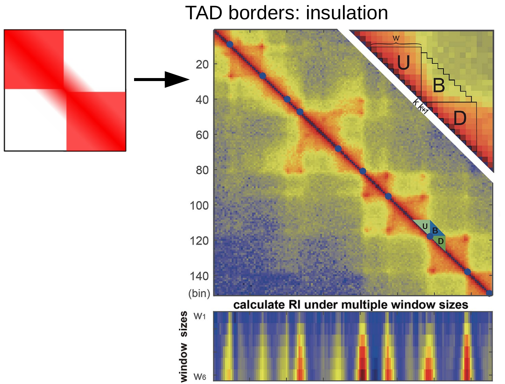
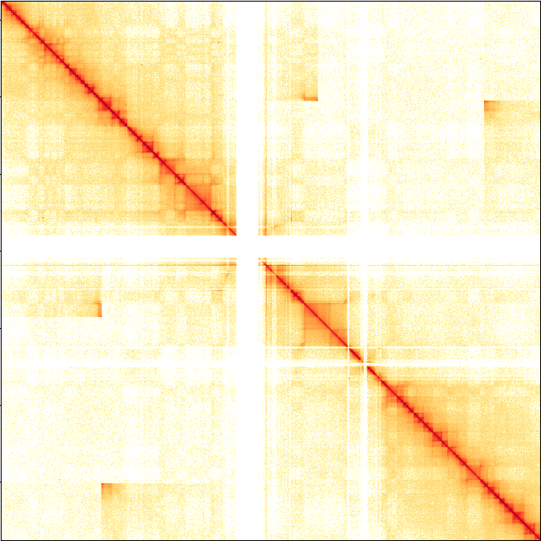
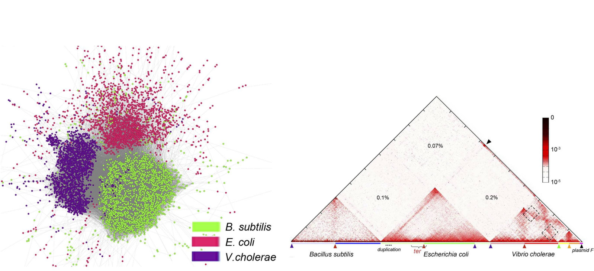

# Applications of chromosome conformation technologies

Day 2

## Biological insights

Several motivations to investigate chromosome conformation:

* Mechanics of regulation: Promoter-enhancer, DNA repair, insulation, ...
* Fundamental physics of chromatin: phase separation, compaction, ...
* 3D model of chromosomes, their organization and segregation

## What to look for in a contact map ?

Extract signals for more quantitative analyses:

> - Contact probability vs genomic distance
> - Insulation score
> - Compartment eigenvectors
> - Feature detection: loops, domains, hairpins, ...

## Distance-dependent contacts

<div class="columns-2">

The diagonal of Hi-C map contains useful information:

* Distant-dependent contact decay follows a power-law
* The slope of the curve gives compaction information
* Can be used to compare polymer models

  ](assets/distance_law_G1_release_yeast.png){width=90%}

</div>

## Insulating boundaries

Chromatin interaction domains are important for gene regulation:

* form compact neighbourhoods of co-regulated genes
* Domain borders prevent interactions with elements outside
* TAD boundary disruption results in gene deregulation ([Lupianez et al., 2015](https://doi.org/10.1016/j.cell.2015.04.004))


## Insulation score

Insulation: Contact depletion between domains

Insulation can be quantified with a numeric score.

{width=50%}


## Chromatin compartments

Active and inactive chromatin is usually classified into A/B compartments

In Hi-C those compartments appear as a plaid-like pattern.

 from Oksuz, Yang et al., bioRxiv 2020.](assets/plaid_compartments.svg){width=80%}

## Compartments eigenvector

* Most common method to identify compartments: PCA on the Hi-C matrix
* Eigenvectors explaining the most variance will contain compartments.
* Must be validated with an external correlated signal (e.g. GC%)

## Compartments eigenvector

```{r, out.width = "80%",  fig.cap= "", echo=FALSE}
knitr::include_graphics("assets/hic_pca_compartments.svg")
```

## Feature detection

<div class="columns-2">

Often we want to automatically find _where_ changes are happening in the genome, such as:

* Chromatin loops
* Domains (CID, TADs, ...)
* General contact intensity changes

"](assets/hiccups.png){width=80%}

</div>

## Limitations of Hi-C

Despite all its uses, Hi-C has several limitations to gain biological insights:

* Resolution limited by restriction enzyme and coverage
* Limited to 2-ways interactions. (methods in development)
* No absolute quantifications, counts are relative

## Alternative uses of Hi-C

<div class='columns-2'>
* Scaffolding genomes: Distance-dependent contacts
  + [instaGRAAL](https://github.com/koszullab/instaGRAAL)
  + [3D-DNA](https://github.com/aidenlab/3d-dna)

{width=90%}
</div>

## Alternative uses of Hi-C

<div class='columns-2'>
* Structural variant detection (deletions, inversions, ...)
  + [Hint](https://github.com/parklab/HiNT)
  + [HiCnv](https://github.com/ay-lab/HiCtrans)

{width=100%}
</div>

## Alternative uses of Hi-C

* Resolving species from metagenomic assemblies:
  + [MetaTOR](https://github.com/koszullab/metaTOR): Metagenome binning using Hi-C.
  + [Strain3C](https://github.com/koadman/strain3C): Strain-level genomes resolution using Hi-C.

```{r, out.width = "90%",  fig.cap= "Marbouty et al., 2014", echo=FALSE}

```

## Alternative uses of Hi-C

* Phasing haplotypes: Stronger cis- than trans-contacts
  + [FALCON-Phase](https://github.com/phasegenomics/FALCON-Phase) (Pacbio + Hi-C)
  + [HapCUT2](https://github.com/vibansal/HapCUT2) (Shotgun, Nanopore, Pacbio, 10X, Hi-C)

# Exercises

* Use python scripting to interact with Hi-C data
* Extract quantitative signal from contact maps
* Feature detection on Hi-C
