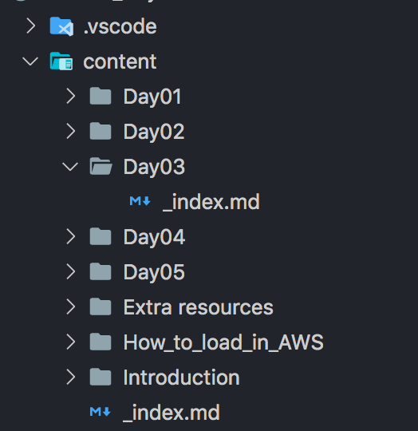

<a href="https://js2264.github.io/NGS-analysis_Physalia_2021/" class="github-corner" aria-label="Return to course website">
<svg width="200" height="200" viewBox="0 0 124.05 124.05" style="fill:#312525; color:#fff; position: absolute; top: 0; border: 0; left: 0;" aria-hidden="true"><path d="M678.5,462.09V345.75H794.84a6.69,6.69,0,0,1,4.73,11.43L689.93,466.82A6.69,6.69,0,0,1,678.5,462.09Z" transform="translate(-678 -345.25)" style="fill:#312525;stroke:#312525;stroke-miterlimit:10"/><path d="M764.89,391.4,750.5,405.79a1.57,1.57,0,0,1-1.11.46H711.12a1.57,1.57,0,0,0-1.57,1.57V418.7a1.57,1.57,0,0,1-2.56,1.23l-27.75-22.37h0L707,375.11a1.57,1.57,0,0,1,2.56,1.22v10.8a1.57,1.57,0,0,0,1.57,1.57h52.66A1.57,1.57,0,0,1,764.89,391.4Z" transform="translate(-678 -345.25)" style="fill:#fff;stroke:#312525;stroke-miterlimit:10"/></svg>
</a>

# How to make a PB&J sandwich

## Bread

I prefer whole wheat bread

## Peanut butter

Creamy pb for sure 

{height=400px}

--- 

{height=200px}

--- 

## Jelly

Nothing compares to my grandma's home made peach jam

# How to make a PB&J sandwich - Part 2

## Bread

I prefer whole wheat bread

## Peanut butter

Creamy pb for sure 

## Jelly

Nothing compares to my grandma's home made peach jam
