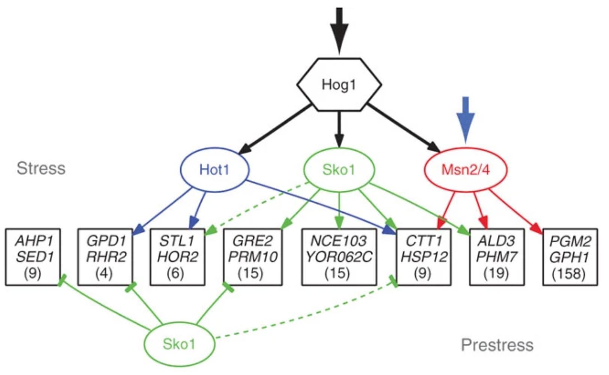
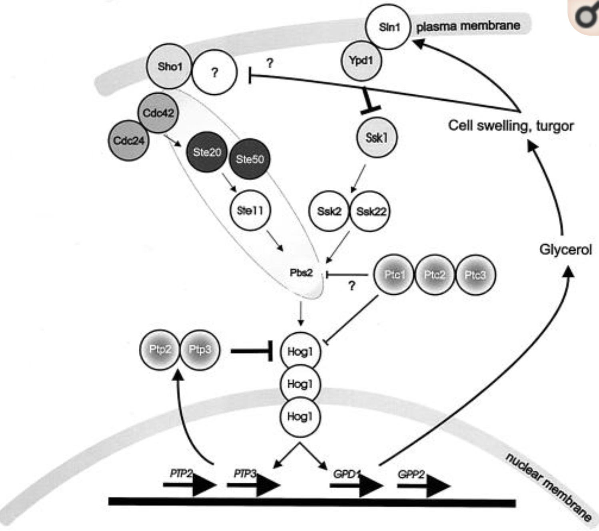

We are going to filter differentially accessbile loci and cluster them based on their dynamic accessibility patterns.  
This will require a bit of data wrangling and eventually, relying on `ggplot` to plot profiles.  

## 1. Import ATAC peaks from YAPC and extract differentially accessible loci

> How were the ATAC peaks saved in the previous exercise? Does this allow easy retrieval of the analysis? Could you suggest another way to save/export data/ 

<details><summary style="color: #ff7f00; font-weight: bold">Show code</summary><p>
```{r}
ATAC_peaks <- readRDS('Share/day04/ATAC_peaks.rds')
```
</p></details><br>

> How can we filter down to DA genes? 

<details><summary style='color: #ff7f00; font-weight: bold'>Show code</summary><p>
```{r}
library(GenomicRanges)
sub <- with(ATAC_peaks, 
    {abs(L2FC_15_v_00) >= log2(1.2) & padj_15_v_00 <= 0.01} |
    {abs(L2FC_30_v_15) >= log2(1.2) & padj_30_v_15 <= 0.01} |
    {abs(L2FC_45_v_30) >= log2(1.2) & padj_45_v_30 <= 0.01} |
    {abs(L2FC_60_v_45) >= log2(1.2) & padj_60_v_45 <= 0.01}
)
ATAC_peaks_DA <- ATAC_peaks[which(sub)]
ATAC_peaks_DA
```
</p></details><br>

## 2. Display dynamics of locus accessibility for the DA loci

To display differences in locus accessibility (or gene expression, or any feature coverage metric...), 
heatmaps are typically used.  
Each row a a heatmap represents a feature (e.g. a chromatin locus) 
and each column represents a sample (e.g. a timepoint). 
The color code indicates the level of feature coverage metric (e.g. accessibility).  

<details><summary style='color: #ff7f00; font-weight: bold'>Show code</summary><p>
```{r}
library(tidyverse)
library(magrittr)
# Create a data frame containing mean-centered log-normalized locus accessibility scores
norm_rlogs <- mcols(ATAC_peaks_DA)[, grepl('rlog_', colnames(mcols(ATAC_peaks)))] %>% 
    apply(1, function(row) {row - mean(row)}) %>% 
    t() %>% 
    as_tibble()
# Reorder the data frame by hierarchical clustering
o <- hclust(dist(norm_rlogs))$order
norm_rlogs <- norm_rlogs[o,]
# Cluster the data frame
norm_rlogs$cluster <- factor(cluster::pam(x = norm_rlogs, k = 8, cluster.only = TRUE))
norm_rlogs$locus <- factor(ATAC_peaks_DA$peakID[o], levels = ATAC_peaks_DA$peakID[o])
# Reformat the data frame into a tidy shape
norm_rlogs <- norm_rlogs %>% 
    gather('timepoint', 'mean_centered_rlog', -locus, -cluster) %>% 
    group_by(cluster) %>% 
    mutate(timepoint = gsub('rlog_', '', timepoint))
# Plot as a heatmap
p <- ggplot(norm_rlogs, aes(x = timepoint, y = locus, fill = mean_centered_rlog)) + 
    geom_tile() + 
    theme_bw() + 
    scale_fill_gradientn(colours = c('white', 'orange', 'darkred')) + 
    theme(
        axis.text.y = element_blank(), 
        axis.ticks.y = element_blank()
    )
p
```
</p></details><br>

Since the datasets represent temporal dynamics of chromatin accessibility, we can also 
plot the data as "continous" lines. Each line represents the level of accessibility of a single 
ATAC peak throughout the experiment. 

<details><summary style='color: #ff7f00; font-weight: bold'>Show code</summary><p>
```{r}
# Plot as faceted line plots
p <- ggplot(norm_rlogs, aes(x = timepoint, y = mean_centered_rlog, fill = cluster, group = locus, col = cluster)) + 
    geom_line() + 
    theme_bw() + 
    facet_wrap(~cluster)
p
```
</p></details><br>

> Comment on the different clusters found in this dataset. 

## 3. Recover loci from each cluster and their associated genes

Clustering DA peaks highlights specific patterns of dynamic chromatin accessibility. 
For instance, despite a rapid initial reduction of chromatin accessibility at their locus, 
peaks in clusters 1 and 4 have quite different behaviors. While peaks in cluster 1 
regain their original level of accessibility, those in cluster 4 stay closed.  
This seems to suggest that the two sets of peaks are both responding to 
osmotic stress, they may not be regulated by the same factors.  

Let's recover the different clusters of peaks as well as the TSS they are associated to.

<details><summary style='color: #ff7f00; font-weight: bold'>Show code</summary><p>
```{r}
clusters_peaks <- lapply(
    1:length(unique(norm_rlogs$cluster)), 
    function(K) {
        norm_rlogs %>% 
            filter(cluster == K) %$% 
            locus %>% 
            unique() %>% 
            as.character()
    }
) %>% setNames(1:length(unique(norm_rlogs$cluster)))
clusters_TSSs <- lapply(
    1:length(clusters_peaks), 
    function(K) {
        unique(ATAC_peaks[ATAC_peaks$peakID %in% clusters_peaks[[K]]]$associated_gene)
    }
) %>% setNames(1:length(clusters_peaks))
clusters_TSSs[[1]]
clusters_TSSs[[4]]
clusters_TSSs[[5]]
```
</p></details><br>

> Do you think this approach recovers all the genes with a regulatory element 
whose accessibility is regulated during response to osmotic stress?  

> Have a look at `Stl1` locus in IGV, after loading the `ATAC_peaks.gff` file and the `.bigwig` files for ATAC-seq. Comment on what you see. 

## Conclusions

Have a look at the following paper, which focus on osmotic stress-related gene regulation: 

* Osmotic Stress Signaling and Osmoadaptation in Yeasts, [(Stefan Hohmann, Microbiol Mol Biol Rev. 2002)](https://www.ncbi.nlm.nih.gov/pmc/articles/PMC120784/)
* Structure and function of a transcriptional network activated by the MAPK Hog1, [(Capaldi et al., Nature Genetics 2008)](https://www.nature.com/articles/ng.235)

Osmotic stress regulatory networks are extensively described in these papers. For instance: 

[](https://www.nature.com/articles/ng.235)
[](https://www.nature.com/articles/ng.235)

> Quickly read these papers. What are the main biological processes involved in response to osmotic stress? 

> List the most important genes that are regulating the response to osmotic stress in Yeast.  

> Do promoters of all the master regulators show dynamic accessibility? Can you speculate why some do not show an increased accessibility?  

<details><summary style="color: #ff7f00; font-weight: bold">Show code</summary><p>
```{r}
# Export as RDS
ATAC_peaks$cluster <- unlist(lapply(
    ATAC_peaks$peakID, 
    function(id) {
        n <- which(unlist(lapply(clusters_peaks, function(set) id %in% set)))
        if (length(n) == 0) {
            0
        } else{
            n
        }
    }
))
saveRDS(ATAC_peaks, 'ATAC_peaks_with_clusters.rds')
```
</p></details><br>
