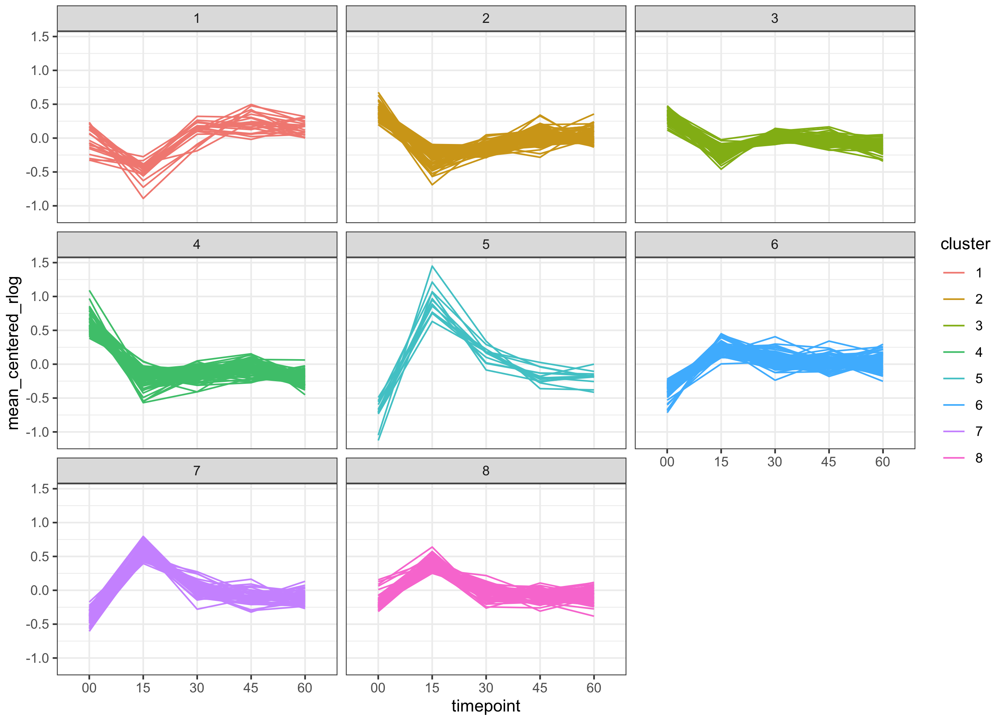

## 1. Group ATAC peaks based on their dynamic accessibility changes

We characterized different clusters of dynamically regulated chromatin loci by ATAC-seq. 

> Can you give a descriptive label to each cluster of ATAC peaks? 

<details><summary style='color: #ff7f00; font-weight: bold'>Show code</summary><p>
Given the patterns of varying chromatin accessibility in each peak cluster (see figure), 
we can merge and label clusters as follows: 



```{r}
library(tidyverse) 
ATAC_peaks <- readRDS("Share/day04/ATAC_peaks_with_clusters.rds")
table(ATAC_peaks$cluster)
cluster_names <- factor(c(
    "0" = "non-DA",
    "1" = "closed_short-term-recovery",
    "2" = "closed_long-term-recovery",
    "3" = "closed_long-term-recovery",
    "4" = "closed_no-recovery",
    "5" = "opened_rapid-response",
    "6" = "opened_no-recovery",
    "7" = "opened_recovery",
    "8" = "opened_recovery"
), levels = c(
    "opened_rapid-response", "opened_recovery", "opened_no-recovery", 
    "closed_short-term-recovery", "closed_long-term-recovery", "closed_no-recovery",
    "non-DA")
)
ATAC_peaks$annot <- cluster_names[as.character(ATAC_peaks$cluster)]
saveRDS(ATAC_peaks, 'ATAC_peaks_with_annots.rds')
#
norm_rlogs <- mcols(ATAC_peaks)[, grepl('rlog_', colnames(mcols(ATAC_peaks)))] %>% 
    apply(1, function(row) {row - mean(row)}) %>% 
    t() %>% 
    as_tibble() %>% 
    mutate(locus = factor(ATAC_peaks$peakID)) %>% 
    mutate(cluster = factor(ATAC_peaks$annot)) %>%
    gather('timepoint', 'mean_centered_rlog', -locus, -cluster) %>% 
    group_by(cluster) %>% 
    mutate(timepoint = gsub('rlog_', '', timepoint))
p <- ggplot(norm_rlogs, aes(x = timepoint, y = mean_centered_rlog, fill = cluster, group = locus, col = cluster)) + 
    geom_line() + 
    theme_bw() + 
    facet_wrap(~cluster)
p
```
</p></details><br>

## 2. Gene Ontology analyses 

Based on previous labelling, there are 3 different groups of chromatin loci which are characterized by 
an increase of accessibility following osmotic stress. 

> Can you investigate the gene ontology of genes close to the chromatin loci in the `opened_recovery` cluster? 

<details><summary style='color: #ff7f00; font-weight: bold'>Show code</summary><p>
```{r}
clusters_TSSs <- lapply(
    levels(ATAC_peaks$annot), 
    function(annot) {
        unique(ATAC_peaks$associated_gene[ATAC_peaks$annot == annot])
    }
) %>% setNames(levels(ATAC_peaks$annot))
lengths(clusters_TSSs)
go_opened_recovery <- gprofiler2::gost(clusters_TSSs[["opened_recovery"]], organism = 'scerevisiae')
go_opened_recovery$result
```
</p></details><br>

> Can you perform the same operation for all the clusters? 

<details><summary style='color: #ff7f00; font-weight: bold'>Show code</summary><p>
```{r}
go_clusters <- lapply(
    levels(ATAC_peaks$annot), 
    function(annot) {
        go_results <- gprofiler2::gost(clusters_TSSs[[annot]], organism = 'scerevisiae')$result
        go_results$annot <- annot
        return(go_results)
    }
) %>% 
    do.call(rbind, .)
go_clusters
table(go_clusters$annot)
go_clusters %>% filter(annot == "opened_recovery")
go_clusters %>% filter(annot == "opened_no-recovery")
go_clusters %>% filter(annot == "closed_short-term-recovery")
go_clusters %>% filter(annot == "closed_no-recovery")
go_clusters %>% filter(annot == "closed_long-term-recovery")
```
</p></details><br>

## 2. Gene Set Enrichment Analysis

GEAS is an approach *kind of* similar to that of GO enrichment analysis, with one big difference. 
In GO enrichment analyses, one specifies a **gene set**, and Gene Ontology terms statistically enriched within this set of genes are retrieved. 
In GEAS analyses, a list of genes (usually all genes in the genome) are ranked by a value (usually the fold-change between 2 conditions). 
Then, for a given gene set of interest (e.g. genes associated with a specific Gene Ontology term), the position of these genes is retrieved in the 
initial list of ranked genes. Based on their position, an enrichment score can be computed, incidicating whether the genes from the set of 
interest are predominently found at the top or at the bottom of the ranked list. 

> Can we perform GSEA in our list of ATAC peaks?

> Can you find an alternative that would allow you to use the list of ATAC peaks for GSEA?

> Import the `Gudin2019.txt` table and rank the genes based on their expression fold-change between 10min of osmotic stress and no treatment

<details><summary style='color: #ff7f00; font-weight: bold'>Show code</summary><p>
```{r}
df <- read.table('Share/day05/Gutin2019.txt', sep = '\t', header = TRUE) %>% 
    dplyr::rename('gene' = 'X') %>% 
    mutate(ratio = WT.t10/WT.t00) %>% 
    filter(!is.infinite(ratio) & !is.na(ratio)) %>% 
    arrange(desc(ratio))
```
</p></details><br>

> Perform GSEA on that ranked list. `gseGO()` is function to perform GSEA using Gene Ontology sets and 
is included in the awesome `clusterProfiler` package. 

<details><summary style='color: #ff7f00; font-weight: bold'>Show code</summary><p>
```{r}
list_genes <- df$ratio
names(list_genes) <- df$gene
gsea_results <- clusterProfiler::gseGO(
    list_genes, 
    keyType = "ENSEMBL", 
    OrgDb = org.Sc.sgd.db::org.Sc.sgd.db,
    verbose = TRUE
)
gsea_results@result[, 1:8] %>% arrange(desc(NES)) %>% head(20)
K <- which(gsea_results@result$Description == 'response to osmotic stress')
enrichplot::gseaplot2(gsea_results, K, title = gsea_results@result$Description[K])
enrichplot::ridgeplot(gsea_results, 20)
```
</p></details><br>

## Conclusions

> Conclude on the relative usefulness of GO enrichment analysis / GSEA